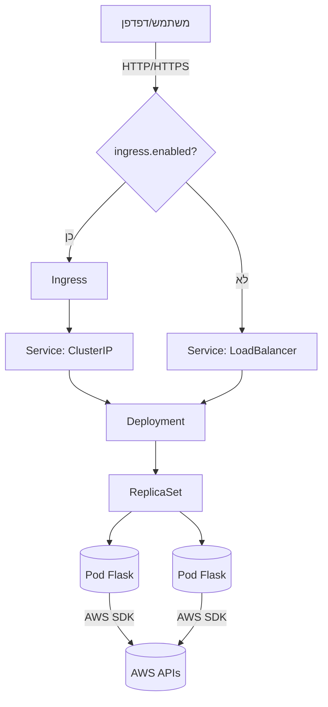
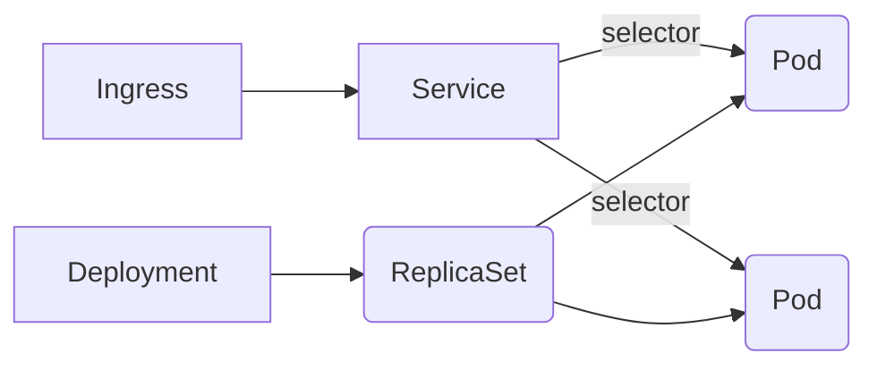
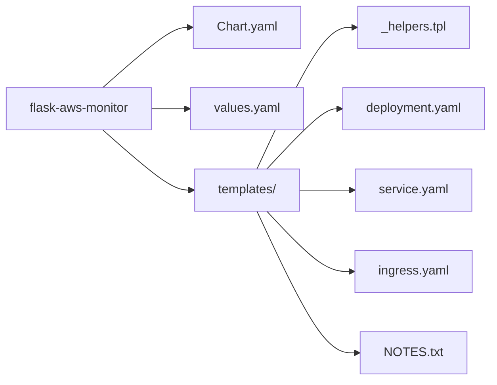
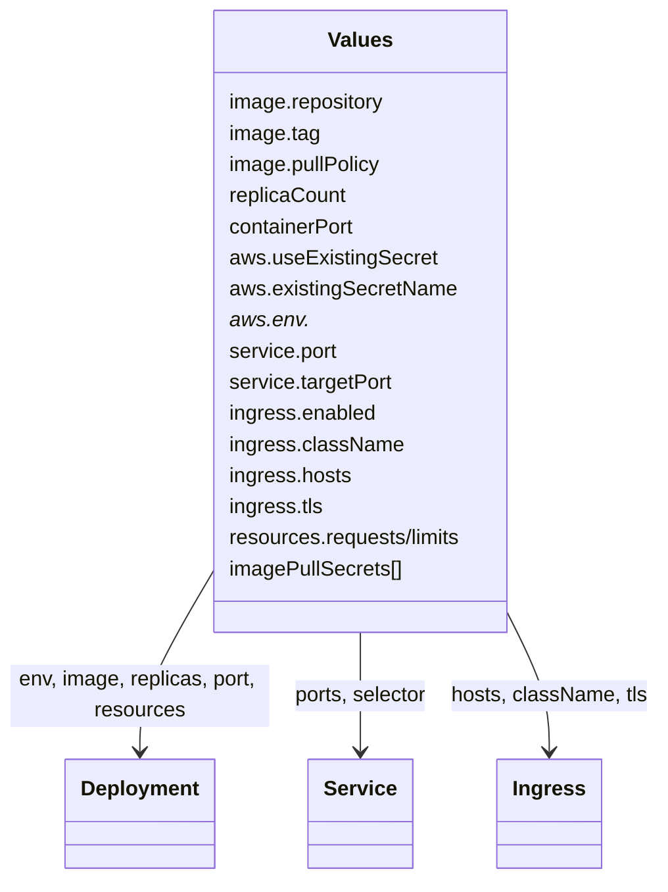
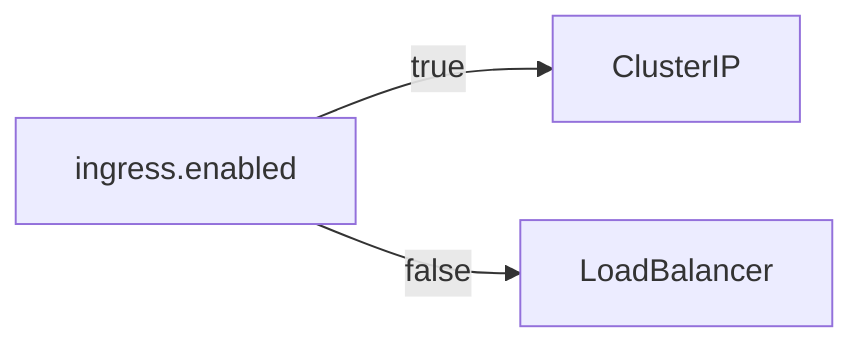
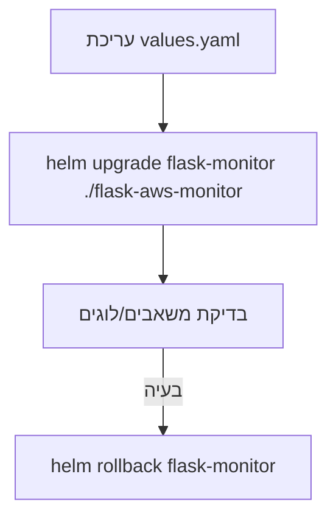
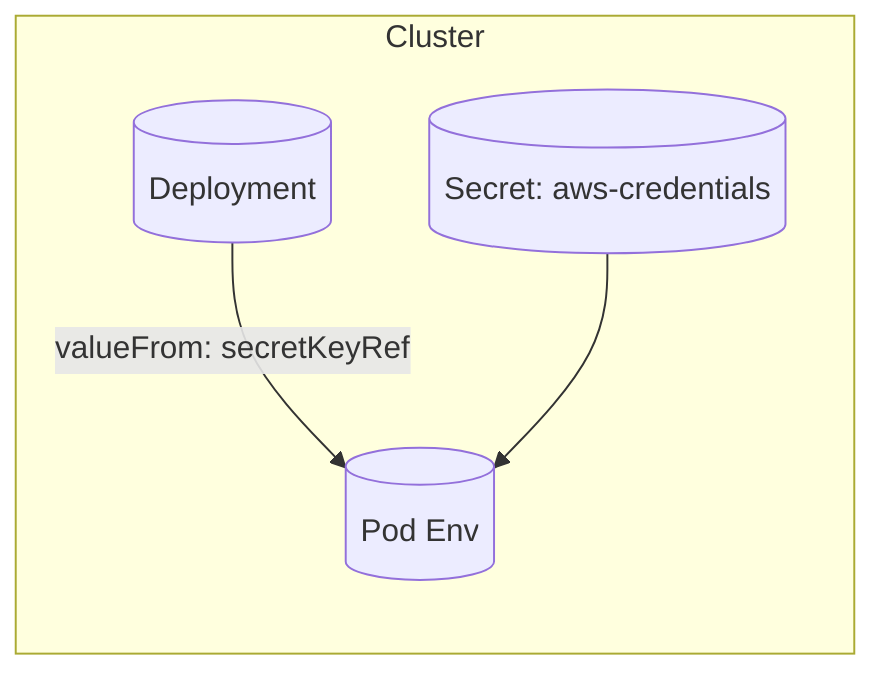
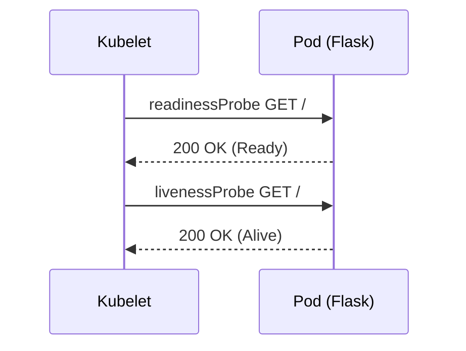

# 📦 Helm + Kubernetes לאפליקציית Flask (ויזואלי)

למטה תמצאו ייצוגים ויזואליים מלאים: ארכיטקטורה, מבנה הצ׳ארט, זרימות התקנה/שדרוג/רולבק, מיפוי values לתבניות, ולוגיקה של Service לפי ingress.

## 🏗️ ארכיטקטורה (Flow)


## 🧱 אובייקטים ב‑Kubernetes


## 🧩 מבנה הצ׳ארט (Helm Chart Structure)


או כעץ קבצים:
```
flask-aws-monitor/
├─ Chart.yaml
├─ values.yaml
└─ templates/
   ├─ _helpers.tpl
   ├─ deployment.yaml
   ├─ service.yaml
   ├─ ingress.yaml
   └─ NOTES.txt
```

## ⚙️ values.yaml → איפה זה משפיע?


## 🔀 לוגיקת בחירת Service לפי ingress (בונוס)


ממומש ב‑`templates/service.yaml` עם `ternary` על `.Values.ingress.enabled`.

## 🚀 תהליך התקנה/בדיקה/גישה
```mermaid
flowchart TD
  A[בדיקת קלאסטר] --> B[helm lint]
  B --> C[helm template (אופציונלי)]
  C --> D[helm install flask-monitor ./flask-aws-monitor]
  D --> E[kubectl get deploy,po,svc -l app.kubernetes.io/instance=flask-monitor]
  E --> F{ingress.enabled?}
  F -- כן --> G[גלישה ל‑host מה‑values]
  F -- לא --> H[קבלת External IP מה‑Service]
```

פקודות לדוגמה:
```
kubectl get nodes
helm lint ./flask-aws-monitor
helm template flask-monitor ./flask-aws-monitor | kubectl apply --dry-run=client -f -
helm install flask-monitor ./flask-aws-monitor
kubectl get deploy,po,svc -l app.kubernetes.io/instance=flask-monitor
```

גישה ללא Ingress:
```
kubectl get svc flask-monitor-flask-aws-monitor \
  -o jsonpath='{.status.loadBalancer.ingress[0].ip}'
# ואז: http://<EXTERNAL_IP>:5001/
```

## 🔁 שדרוגים ורולבק


## 🔐 AWS Secrets (ויזואלי)


יצירת Secret לדוגמה:
```
kubectl create secret generic aws-credentials \
  --from-literal=AWS_ACCESS_KEY_ID=XXX \
  --from-literal=AWS_SECRET_ACCESS_KEY=YYY \
  --from-literal=AWS_DEFAULT_REGION=us-east-1
```
הגדרות ב‑values:
```
aws:
  useExistingSecret: true
  existingSecretName: aws-credentials
```

## 🧪 בריאות האפליקציה


## 🛠️ טכנולוגיות
- Kubernetes, Helm (application chart)
- Docker Image: `formy5000/resources_viewer:latest` (ניתן להחלפה)
- Flask (פורט 5001)

## 👀 תצוגה מקדימה (VS Code Preview)
- דרישות: VS Code 1.67+ (כולל Mermaid מובנה) או התקנת התוסף `bierner.markdown-mermaid`.
- פתיחה: `Ctrl+Shift+V` או פקודת Command Palette: `Markdown: Open Preview to the Side`.
- אם התרשימים לא מוצגים:
  - אשרו Trust לחלון העבודה (Workspace Trust).
  - ודאו שהתוסף `Markdown Mermaid` פעיל (Extensions → חיפוש mermaid).
  - לחלופין התקינו `Markdown Preview Mermaid Support`.

## ✅ מה מכוסה לפי ההוראות
- Deployment: תדמית מה‑Docker Hub, משיכת latest, env ל‑AWS, פורט 5001, probes, resources.
- Service: פורט 5001, סוג נקבע אוטומטית לפי `ingress.enabled` (בונוס).
- Ingress: נוצר רק כאשר `ingress.enabled=true` ומנתב לפי hosts/paths.
- values.yaml: תדמית/תג, משתני AWS, replicaCount, משאבים, ingress.
- labels אחידים דרך `_helpers.tpl`.

---
קובץ זה ממוקד בויזואליזציות כדי לאפשר קליטה מהירה של הארכיטקטורה וה‑flow. לקבלת פירוט טכני נוסיף/נעדכן לפי צורך.
